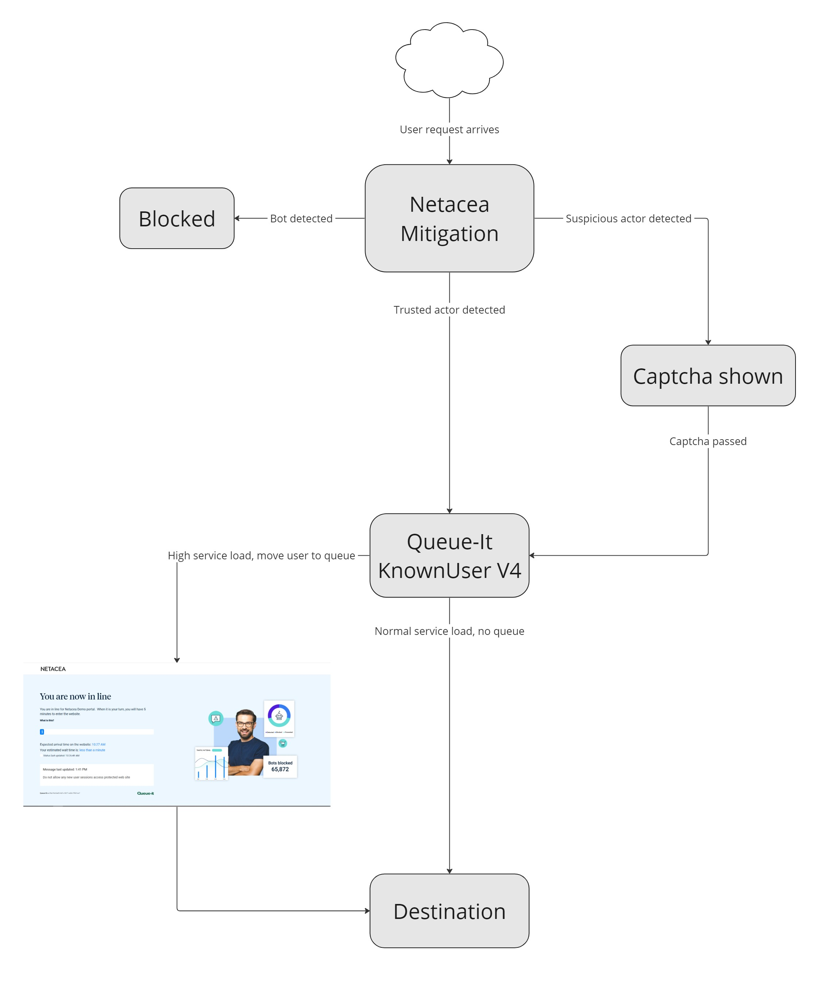

# Queue-It POC Cloudflare Worker

This repository contains an example integration of Netacea's bot detection with Queue-It's KnownUser V4 package.
It is currently deployed in [https://queue.netacea-int.co.uk/](https://queue.netacea-int.co.uk/).

## Installation

To install all dependecies, run `npm ci` in the root level of this repository. Afterwards move to `src/connector-cloudflare-4.1.1`, and run `npm ci` once more to install KnownUser V4 dependencies.

## Configuration

Copy `wrangler.toml.exmple` into `wrangler.toml` and edit `account_id`, `route`, and `IntegrationConfigKV` binding IDs as necessary.
After that, copy `NetaceaConfig.example.json` into `NetaceaConfig.json`, and replace example config values as needed.

## Deployment

To deploy the worker, run `npm run publish` in the root directory. Configuration must be completed for deployment to succeed.

## Useful resources

Below is a list of useful resources gathered during creation of this integration:

* [KnownUser V3 repository](https://github.com/queueit/KnownUser.V3.Javascript)
* [KnownUser V4 documentation (requires Queue-It login)](https://support.queue-it.com/hc/en-us/article_attachments/8583618914076/Queue-it_Cloudflare_V4_Connector_Implementation_Guide.pdf)
* [Queue-It JavaScript Connector documentation (requires Queue-It login)](https://support.queue-it.com/hc/en-us/articles/7978446023580-JavaScript-Connector-Version-4-1)
* [Queue-It general documentation (requires Queue-It login)](https://support.queue-it.com/hc/en-us/sections/7150475749916-General-Documentation)
